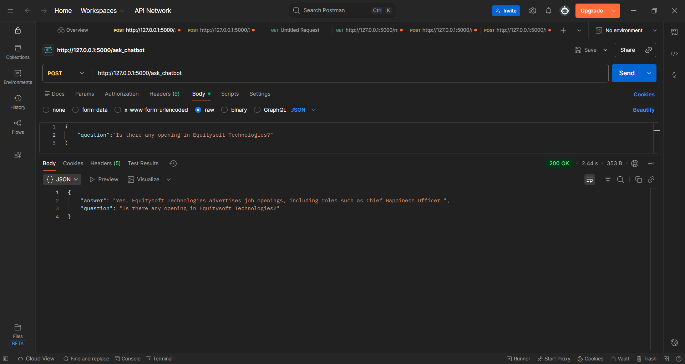
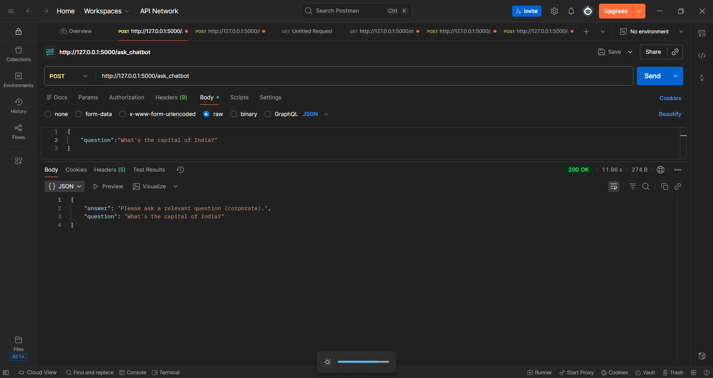

# Chatbot : Upload PDF and ask Questions

This is a question answering chatbot app built with Flask, Pinecone and Gemini. This chatbot is especially built for corporates.
Upload your company PDFs and let chatbot answer all the employees doubts.

## Features

1. '/upload_pdf' POST: To upload company's PDF, extract the text from the pdf and store them into chunks in Pinecone.
2. '/ask_chatbot' POST: To ask question from the uploaded PDFs, It also consists of a prompt to guide gemini-2.5-flash for responses.
3. def embed_text(): To embedd the PDF using text-embedding-004
4. def extract_text_from_file(): To extract the text from the uploaded PDFs.
5. def split_text(): To split the text after max_length=200
6. def store_chunks_pinecone(): To store the data in vector form inside Pincone index
* pincone_index_name: To store the vector embeddings, here it's named as "rag"
* Distance metric:cosine, it's measures the cosine of the angle between two vectors.
* pc.create_index: To create an index in Pincone if it's doesnt exists
* model = To generate the responses using LLM and the uploaded pdf according to the prompt, here I've used gemini-2.5-flash.
* dimension = Vector embedding stored inside the index rag has 768 numerical features. 

## Technologies used:

1. Flask: Backend
2. Pincone: To store the embedding vectors
3. Gemini: To generate custom outputs
4. PyPDF2: To read the uploaded PDFs
5. load_dotenv: To load the api_keys from .env  

### API keys:

1. gemini_api_key
2. pinecone_api_key

## Outputs:

1. 

2. 

3. For irrelevant questions: 

